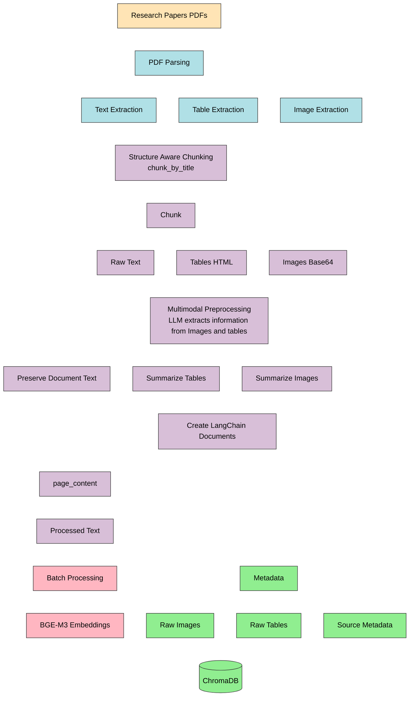
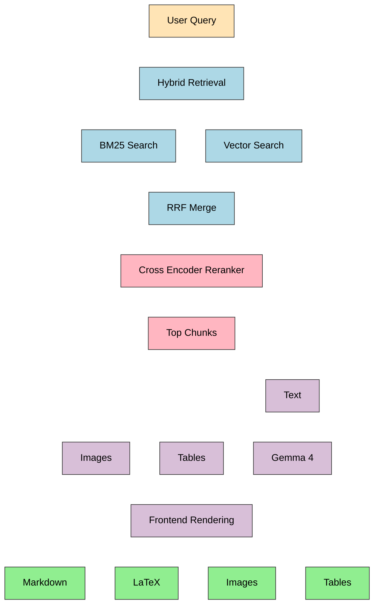

# Research RAG

---

## Overview 

---

>This is a multimodal Retrieval-Augmented Generation (RAG) system , which ingests various research papers related to LLMs, Transformers and RAG systems. The architecture supports multi-modal retrieval capabilities, allowing extraction of relevant textual content, tables, and images from research documents. This is achieved by converting images and tables into summarized textual representations using a LLM and store their embeddings in the VectorDatabase. Retrieved outputs are rendered through a frontend supporting Markdown, LaTeX enabling structured visualization of mathematical expressions, technical content, and research artifacts.

## Features

---

1. **Multimodal RAG** - Retrieves textual content, tables, and images from research papers
2. **Reranking** - Reranks retrieved chunks to select highly relevant chunks.
3. **Hybrid Search** - Hybrid search combines keyword search (BM25) with vector search 
4. **Multi paper retrieval** - Supports retrieval across multiple research papers simultaneously
5. **LaTex and Markdown Support**
6. **Images and Tables Information are Retained**

## Tech Stacks

---

1. **LangChain** (RAG Orchestration)
2. **Gemma 4** (Locally Hosted LLM)
3. **BGE-M3** (Embedding Model)
4. **Unstructured** (PDF Parsing & Structure-Aware Chunking)
5. **bge-reranker-v2-m3** (Cross-Encoder)
6. **Ollama** (Runs LLMs locally)
7. **FastAPI** (Backend API)
8. **HTML, CSS, JavaScript** (Frontend)
9. **ChromaDB** (Vector Database)

## Ingestion Pipeline

---

## Retrieval Pipeline

