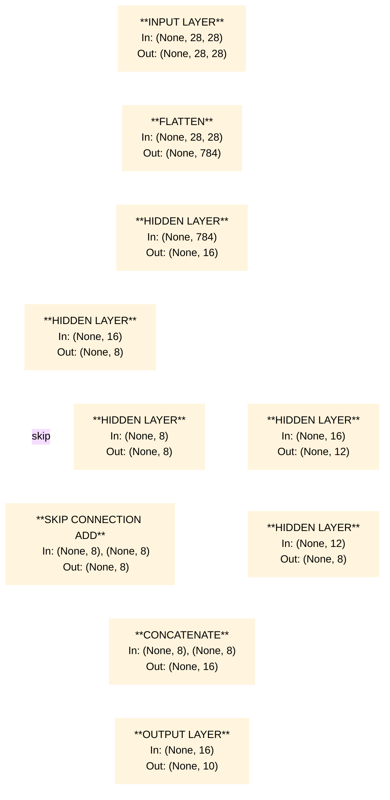

 # Base Task
 ---
 ## Overview
 
This base task implements an image classification pipeline for the FashionMNIST dataset using PyTorch.

The project trains a given Neural network architecture  to classify grayscale clothing images into 10 categories.

---
## Model Architecture

---
## Hyperparameters

```text
Batch Size: 64

Optimizer: AdamW

Learning Rate: 1e-3

Loss Function: CrossEntropyLoss
```
---
## Files

| File | Description |
|------|-------------|
| `base_task.ipynb` | Training notebook — model definition, training loop, evaluation |
| `saved_models/best_model.pkl` | Best checkpoint, saved at lowest validation loss |
| `saved_models/model.pkl` | Saved at last validation loss |
| `CSV_files/submissions.csv` | Test set predictions with truth labels |
| `CSV_files/sub.xlsx` | Test images alongside their predicted classes |
---
## Results

| Model | Validation Accuracy | Test Accuracy |
|-------|-------------------|---------------|
| Best checkpoint (`best_model.pkl`) | 87.05% | 86.13%|
| Final epoch (`model.pkl`) | 86.6% | 86.09% |
---
